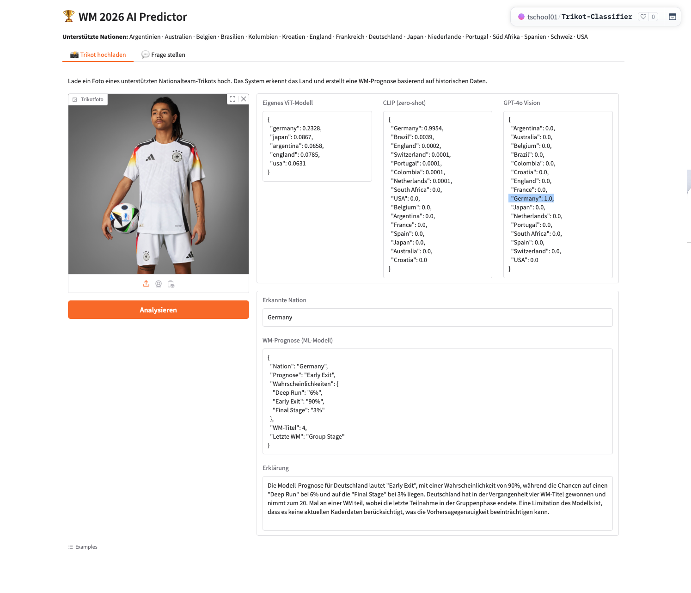
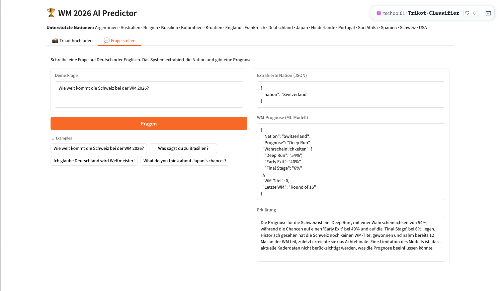

# WM 2026 – AI-Based World Cup Prediction

Use this template to document your project concisely and completely.
Fill in all required fields. Keep answers short and precise.

## Documentation Hint

Important:
When possible, reference the corresponding code location directly in your description.

### Example: Reference to a notebook section
Reference to the header `## Data Preprocessing` in the notebook `analysis.ipynb`:

> See *Data Preprocessing* in
> [`analysis.ipynb`](analysis.ipynb#data-preprocessing)

### Example: Reference to Python code

Reference to a single line in `model.py`, line 42:
> [`model.py`, line 42](model.py#L42)

Reference to multiple lines in `train.py`, lines 15-38:
> [`train.py`, lines 15-38](train.py#L15-L38)

## Project Metadata

- Project title: WM 2026 – AI-Based World Cup Prediction
- Student: Olivia Tschopp
- GitHub repository URL: https://github.com/egolivia/wm2026-ai-analysis
- Deployment URL: https://huggingface.co/spaces/tschool01/Trikot-Classifier
- Submission date: 07 June 2026

### Mandatory Setup Checks

- [x] At least 2 blocks selected
- [x] Multiple and different data sources used
- [x] Deployment URL provided
- [x] Required GitHub users added to repository (`jasminh`, `bkuehnis`)

## Selected AI Blocks

- [x] ML Numeric Data
- [x] NLP
- [x] Computer Vision

Primary blocks used for core solution (choose 2):
- Primary block 1: ML Numeric Data
- Primary block 2: Computer Vision

If a third block is selected, it is documented and graded separately as extra work.

Guidance hint: Keep the project idea short and consistent. Focus most details on the selected blocks.
Evidence hint: Show where each selected block contributes to the final system.

---

## 1. Project Foundation (Short)

### 1.1 Problem Definition
- Problem statement: Given a photo of a national football team jersey, predict how far that nation will advance at the FIFA World Cup 2026 based on historical FIFA tournament data (1930–2022), and explain the prediction in natural language.
- Goal: Build a three-stage AI pipeline that combines image recognition, historical data analysis, and conversational explanation into a single interactive web application.
- Success criteria: The app correctly identifies the nation from a jersey image, produces a data-driven WM stage prediction (Gruppenphase / Viertelfinale / Halbfinale–Finale), and generates a clear German-language explanation with historical context.

### 1.2 Integration Logic
- How the selected blocks interact: Computer Vision identifies the nation from the jersey image → ML uses the nation name to retrieve historical FIFA features and predict the WM stage → NLP receives the prediction and probabilities and generates a natural-language explanation. The user can also type a question directly on a seperate Tab. 
- Data and output flow between blocks:
  1. **CV → ML:** `get_top_nation(image_path)` returns a nation string (e.g. `"Brazil"`) which is passed to `predict_nation(team)`.
  2. **ML → NLP:** `predict_nation()` returns a dict with `prediction`, `probabilities`, `n_titles`, `n_participations`, `last_stage` which is passed to `explain_prediction_v2()`.
  3. **NLP → User:** A German-language explanation is displayed alongside the extracted JSON and prediction.

**Pipeline Overview (AI generated illustration):**

```
Path A – Jersey Image
┌─────────────────┐     nation string      ┌──────────────────────┐     prediction dict    ┌─────────────────────┐
│  Computer Vision │ ──────────────────────▶│   ML Numeric Data    │ ──────────────────────▶│        NLP          │
│  (ViT / CLIP /  │   e.g. "Brazil"        │  GradientBoosting    │  {prediction,          │  GPT-4o-mini        │
│   GPT-4o Vision)│                        │  on FIFA data        │   probabilities,       │  German explanation │
└─────────────────┘                        │  1930–2022           │   n_titles, ...}       └──────────┬──────────┘
        ▲                                  └──────────────────────┘                                   │
        │ jersey photo                                                                                  │
        │                                                                                               ▼
   [User Upload]                                                                               [Gradio UI Output]

Path B – Text Question
┌─────────────────┐     nation string      ┌──────────────────────┐     prediction dict    ┌─────────────────────┐
│      NLP        │ ──────────────────────▶│   ML Numeric Data    │ ──────────────────────▶│        NLP          │
│  GPT-4o-mini    │   e.g. "Switzerland"   │  (same model)        │                        │  (same model)       │
│  extraction     │                        └──────────────────────┘                        └─────────────────────┘
└─────────────────┘
        ▲
        │ free-text question
        │
   [User Input]
```

Guidance hint: This section should be short. The detailed work belongs in block sections.
Evidence hint: Include one clear pipeline overview.

---

## 2. Block Documentation


### 2A. ML Numeric Data (If selected)

#### 2A.1 Data Source(s)
List every usage of a data source as a separate entry. If the same source is used twice for different roles, add it twice.

| Entry | Source name or link | Type | Size | Role in this block |
| --- | --- | --- | --- | --- |
| 1 | FIFA World Cup per-year CSVs (1930–2022) | CSV (22 files) | ~500 rows total | Per-nation per-tournament statistics (wins, goals, position) |
| 2 | FIFA World Cup Summary CSV | CSV (1 file) | 22 rows | Tournament-level data (champion, runner-up, teams) |

See *Data Loading* in [`Block1 ML/notebooks/wm2026_ml_prediction.ipynb`, cell 3](Block1%20ML/notebooks/wm2026_ml_prediction.ipynb)

#### 2A.2 Preprocessing and Features
- Cleaning steps: All numeric columns cast to float using `pd.to_numeric(..., errors='coerce')`. Team names harmonised: `"West Germany"` → `"Germany"`, `"United States"` → `"USA"`.
- Preprocessing steps: Historical data filtered to 16 target nations. Finishing position mapped to 6 tournament stages (Group Stage → Champion), then to a numeric value (0–5).
- Feature engineering and selection: 11 features computed per nation using only data from tournaments *prior* to the prediction year (no data leakage): `n_participations`, `n_titles`, `n_finals`, `n_semis`, `avg_stage_all`, `avg_stage_last3`, `last_stage`, `win_rate`, `goal_diff_pg`, `goals_for_pg`, `trend`.
- EDA key findings: Class distribution is imbalanced — most nations reach "Gruppenphase" or "Viertelfinale", very few become champions. Brazil and Germany dominate the "Halbfinale/Finale" class. Win rate and `avg_stage_all` show the highest correlation with final tournament stage. Nations with fewer than 5 participations (e.g. Australia, South Africa) have sparse feature vectors, making predictions less reliable.

See *Exploratory Data Analysis* in [`Block1 ML/notebooks/wm2026_ml_prediction.ipynb`, cell 11](Block1%20ML/notebooks/wm2026_ml_prediction.ipynb)

See *Feature Engineering* in [`Block1 ML/notebooks/wm2026_ml_prediction.ipynb`, cell 14](Block1%20ML/notebooks/wm2026_ml_prediction.ipynb)

#### 2A.3 Model Selection
- Models tested: Logistic Regression, Random Forest, Gradient Boosting
- Why these models were chosen: Logistic Regression as a linear baseline; Random Forest for robustness with small datasets; Gradient Boosting for sequential error correction which typically outperforms RF on tabular data.

See *Model Training Iteration 1 & 2* in [`Block1 ML/notebooks/wm2026_ml_prediction.ipynb`, cells 17–21](Block1%20ML/notebooks/wm2026_ml_prediction.ipynb)

#### 2A.4 Model Comparison and Iterations
| Iteration | Objective | Key changes | Models used | Main metric | Change vs previous |
| --- | --- | --- | --- | --- | --- |
| 1 | Establish baseline | 6-class target, no tuning | Logistic Regression (36.4%), Random Forest (34.0%) | 5-Fold CV Accuracy | – |
| 2 | Reduce class imbalance | 3-class target (Gruppenphase / Viertelfinale / Halbfinale–Finale), RF hyperparameter tuning, Gradient Boosting added | LR (54.0%), RF (56.8%), GB (54.6%) | 5-Fold CV Accuracy | +22.8 pp vs Iter. 1 (best model) |

See *Model Training Iteration 1 & 2* in [`Block1 ML/notebooks/wm2026_ml_prediction.ipynb`, cells 17–21](Block1%20ML/notebooks/wm2026_ml_prediction.ipynb)

#### 2A.5 Evaluation and Error Analysis
- Metrics used: 5-Fold Stratified Cross-Validation Accuracy
- Final results: Gradient Boosting selected as final model (CV: 54.6% ± 5.9%). Random Forest achieved marginally higher CV (56.8%) but with higher variance (±6.5%); Gradient Boosting was preferred for its sequential error-correction approach on this imbalanced tabular dataset. Model saved to `Block1 ML/models/wm2026_model.pkl`.
- Error patterns and likely causes: Limited training data per nation (max ~18 tournaments per nation) constrains model accuracy. Nations with fewer historical WM participations (e.g. Australia, South Africa) have less reliable predictions. The 3-class grouping in Iteration 2 mitigates class imbalance compared to the 6-class setup.

See *Best Model Training & Saving* in [`Block1 ML/notebooks/wm2026_ml_prediction.ipynb`, cell 25](Block1%20ML/notebooks/wm2026_ml_prediction.ipynb)

#### 2A.6 Integration with Other Block(s)
- Inputs received from other block(s): Nation name (string) from CV block via `get_top_nation(image_path)`, or directly from user text via NLP block.
- Outputs provided to other block(s): `predict_nation(team)` returns prediction label, class probabilities, and historical stats → consumed by NLP block for explanation generation.

---

### 2B. NLP (If selected)

#### 2B.1 Data Source(s)

| Entry | Source name or link | Type | Size | Role in this block |
| --- | --- | --- | --- | --- |
| 1 | User free-text input (German/English) | Text (runtime) | Variable | Input to nation extraction prompt |
| 2 | ML model output (prediction dict) | Structured dict (runtime) | 1 record | Input to explanation generation prompt |
| 3 | Historical FIFA stats (from ML block) | Numeric features | 16 records | Context for explanation (titles, participations, last stage) |

#### 2B.2 Preprocessing and Prompt Design
- Text preprocessing: No classical NLP preprocessing (tokenisation, stemming) applied. Nation names normalised by GPT via explicit list in prompt. Edge cases handled: nicknames (e.g. "Nati", "Oranje"), partial names, unsupported nations → `null` fallback.
- Prompt design or retrieval setup: Two-step prompt chain: (1) Nation extraction prompt with explicit list of 16 nations and JSON output format; (2) Explanation prompt with structured input (prediction, probabilities, historical stats) and constrained JSON output.

See *Prompt Design* in [`Block3 NLP/notebooks/wm2026_nlp_agent.ipynb`, cells 5–12](Block3%20NLP/notebooks/wm2026_nlp_agent.ipynb)

#### 2B.3 Approach Selection
- Approach used: Prompt engineering with GPT-4o-mini. Two-step pipeline: structured JSON extraction followed by constrained explanation generation.
- Alternatives considered: Classical NER for nation extraction (rejected: too rigid for nicknames and multiple languages); RAG (rejected: no document corpus needed, all context fits in prompt).

See *Prompt Design – Step 1: Nation Extraction* in [`Block3 NLP/notebooks/wm2026_nlp_agent.ipynb`, cell 5](Block3%20NLP/notebooks/wm2026_nlp_agent.ipynb)

#### 2B.4 Comparison and Iterations

**Extraction (Step 1):**

| Iteration | Objective | Key changes | Model or prompt setup | Main metric or qualitative check | Change vs previous |
| --- | --- | --- | --- | --- | --- |
| 1 | Baseline extraction | No nation list, free output | GPT-4o-mini, simple system prompt | Correct nation extracted (manual check) | – |
| 2 | Robust extraction | Added explicit nation list, null fallback for unknown nations, validation against list | GPT-4o-mini, structured prompt with constraints | Correct nation + correct null for edge cases | Better handling of nicknames and unsupported nations |

**Explanation (Step 2):**

| Iteration | Objective | Key changes | Model or prompt setup | Main metric or qualitative check | Change vs previous |
| --- | --- | --- | --- | --- | --- |
| 1 | Baseline explanation | Free-text output, no structure | GPT-4o-mini, 2-sentence prompt | Qualitative: readable and relevant | – |
| 2 | Structured explanation | JSON output enforced, probabilities included, model limitation mentioned | GPT-4o-mini, detailed system prompt with JSON schema | Qualitative: consistent format, informative, honest | More structured, includes uncertainty |

See *Comparison Iter 1 vs Iter 2* (cell 9) and *Prompt Design – Step 2* (cell 10) in [`Block3 NLP/notebooks/wm2026_nlp_agent.ipynb`](Block3%20NLP/notebooks/wm2026_nlp_agent.ipynb)

#### 2B.5 Evaluation and Error Analysis
- Evaluation strategy: Manual qualitative evaluation on 7 test inputs covering normal cases, nicknames, unsupported nations, and empty inputs.
- Results: Iteration 2 correctly handles all test cases including edge cases ("Nati" → Switzerland, "Oranje" → Netherlands, "Marokko" → null).
- Error patterns and likely causes: GPT occasionally maps ambiguous nicknames to wrong nations without explicit list. Fixed in Iteration 2 via constrained prompt. Model limitation (no current squad data) is communicated in every explanation.

See *Full Pipeline Test* in [`Block3 NLP/notebooks/wm2026_nlp_agent.ipynb`, cell 14](Block3%20NLP/notebooks/wm2026_nlp_agent.ipynb)

#### 2B.6 Integration with Other Block(s)
- Inputs received from other block(s): Prediction dict from ML block (team, prediction label, probabilities, n_titles, n_participations, last_stage).
- Outputs provided to other block(s): German-language explanation string displayed in Gradio UI. Nation string extracted from user text passed to ML block when user types instead of uploading image.

---

### 2C. Computer Vision (If selected)

#### 2C.1 Data Source(s)

| Entry | Source name or link | Type | Size | Role in this block |
| --- | --- | --- | --- | --- |
| 1 | Bing Image Search (jersey images, collected via icrawler) | JPEG images | 400 images (25 × 16 nations) | Training and evaluation of custom ViT classifier |
| 2 | ImageNet-21k (via `google/vit-base-patch16-224-in21k`) | Pretrained weights | 86M parameters | Pretrained backbone for transfer learning |
| 3 | `openai/clip-vit-large-patch14` (Hugging Face) | Pretrained model | – | Zero-shot comparison model |
| 4 | GPT-4o (OpenAI API) | Closed-source model | – | Closed-source comparison model |

See *Data Check* in [`Block2 Computer Vision/notebooks/wm2026_cv_jersey_classifier.ipynb`, cell 4](Block2%20Computer%20Vision/notebooks/wm2026_cv_jersey_classifier.ipynb)

#### 2C.2 Preprocessing and Augmentation
- Image preprocessing: All images resized to 224×224, converted to RGB, normalised with ImageNet mean and std (`processor.image_mean`, `processor.image_std`).
- Augmentation strategy (training only): Random horizontal flip, colour jitter (brightness ±0.2, contrast ±0.2, saturation ±0.2) to increase effective dataset size and robustness.

See *Data Preparation* in [`Block2 Computer Vision/notebooks/wm2026_cv_jersey_classifier.ipynb`, cell 7](Block2%20Computer%20Vision/notebooks/wm2026_cv_jersey_classifier.ipynb)

#### 2C.3 Model Selection
- Vision model(s) used: ViT-base-patch16-224 (pretrained on ImageNet-21k), CLIP ViT-large-patch14 (zero-shot), GPT-4o (vision API).
- Why these model(s) were chosen: ViT is the standard for image classification with the Hugging Face Trainer API (same approach as Exercise 2). CLIP enables zero-shot classification without fine-tuning. GPT-4o represents the closed-source state-of-the-art, matching the Übung 2 comparison structure.

See *Model – Iteration 1* (cell 11) and *Model – Iteration 2* (cell 15) in [`Block2 Computer Vision/notebooks/wm2026_cv_jersey_classifier.ipynb`](Block2%20Computer%20Vision/notebooks/wm2026_cv_jersey_classifier.ipynb)

#### 2C.4 Model Comparison and Iterations
| Iteration | Objective | Key changes | Model(s) used | Main metric | Change vs previous |
| --- | --- | --- | --- | --- | --- |
| 1 | Baseline transfer learning | Backbone frozen, only classifier head trained, 5 epochs, LR 2e-4 | ViT-base (ImageNet-21k) | Val Accuracy: 15.0% | – |
| 2 | Full fine-tuning | Entire backbone unfrozen, 10 epochs, LR 1e-5, warmup 50 steps, weight decay 0.01 | ViT-base (ImageNet-21k) | Val Accuracy: 31.7% / Test: 38.3% | +16.7 pp val accuracy vs Iter. 1 |

| Model | Test Accuracy | Notes |
|---|---|---|
| ViT Iter 1 (frozen) | 15.0% (val) | Head-only training, 5 epochs |
| ViT Iter 2 (full FT) | 38.3% (60 images) | Full backbone fine-tuning, 10 epochs |
| CLIP (zero-shot) | **96.7%** (58/60 images) | No fine-tuning, same test set as ViT |
| GPT-4o (vision) | **93.8%** (15/16 nations) | 1 image per nation; outputs binary confidence |

See *Model Comparison – Quantitative Evaluation* in [`Block2 Computer Vision/notebooks/wm2026_cv_jersey_classifier.ipynb`, cell 27](Block2%20Computer%20Vision/notebooks/wm2026_cv_jersey_classifier.ipynb)

#### 2C.5 Evaluation and Error Analysis
- Metrics and/or visual checks: Classification report (precision, recall, F1 per class), confusion matrix, visual inspection of example predictions.
- Final results: ViT test accuracy 38.3% (random baseline: 6.25%). CLIP outperforms ViT with 96.7% zero-shot; GPT-4o achieves 93.8%. Model uploaded to `tschool01/wm2026-jersey-classifier`.
- Error patterns and limitations: Nations with similar jersey colours (e.g. Germany/England both white) show higher ViT confusion. Netherlands and Portugal had 0% recall in the ViT test set. Root cause: only 25 training images per nation with high visual similarity. CLIP's strong zero-shot performance confirms the task is solvable but requires more training data or a stronger backbone for the custom model.

See *Evaluation on Test Set* in [`Block2 Computer Vision/notebooks/wm2026_cv_jersey_classifier.ipynb`, cell 18](Block2%20Computer%20Vision/notebooks/wm2026_cv_jersey_classifier.ipynb)

#### 2C.6 Integration with Other Block(s)
- Inputs received from other block(s): None (CV is the entry point of the pipeline when image is uploaded).
- Outputs provided to other block(s): `get_top_nation(image_path)` returns nation string (e.g. `"Brazil"`) → passed as input to ML block `predict_nation()`.

---

## 3. Deployment

- Deployment URL: https://huggingface.co/spaces/tschool01/Trikot-Classifier
- Main user flow:
  1. User uploads a jersey photo **or** types a question in German/English
  2. CV model identifies the nation (image path) or GPT extracts the nation (text path)
  3. ML model predicts WM stage with probabilities
  4. GPT generates a German explanation with historical context
  5. App displays: extracted nation JSON, prediction, probabilities, explanation
- Screenshot:





---

## 4. Execution Instructions

- Environment setup:
  ```bash
  conda activate base
  pip install torch torchvision transformers datasets evaluate accelerate huggingface_hub openai gradio joblib pandas scikit-learn icrawler
  ```
- Data setup: FIFA CSVs already in `data/FIFA/`. Jersey images in `data/jerseys/` (collected via `data/download_jerseys.py`).
- Training command(s):
  - ML: Run all cells in [`Block1 ML/notebooks/wm2026_ml_prediction.ipynb`](Block1%20ML/notebooks/wm2026_ml_prediction.ipynb) → saves `Block1 ML/models/wm2026_model.pkl`
  - CV: Run all cells in [`Block2 Computer Vision/notebooks/wm2026_cv_jersey_classifier.ipynb`](Block2%20Computer%20Vision/notebooks/wm2026_cv_jersey_classifier.ipynb) → saves checkpoint to `Block2 Computer Vision/models/vit-iter2/`
- Inference/run command(s):
  ```bash
  cd app
  python app.py
  ```
- Reproducibility notes: `random_state=42` used throughout ML training. `stratify=all_labels` ensures balanced train/val/test splits. ViT training uses fixed `seed=42` via `TrainingArguments`.

---

## 5. Optional Bonus Evidence

Use this section for exceptional work beyond the core requirements.

- [x] Third selected block implemented with strong quality
- [x] More than two data sources used with clear added value
- [ ] A core section is done exceptionally well
- [ ] Extended evaluation
- [ ] Ethics, bias, or fairness analysis
- [ ] Creative or exceptional use case

Evidence for selected bonus items:
- **Third block (NLP):** Fully implemented two-step prompt chain with JSON output, edge case handling (nicknames, unsupported nations), and two documented prompt iterations. Directly integrated into the pipeline as the explanation layer.
- **Multiple data sources:** FIFA per-year CSVs (22 files, 1930–2022), FIFA summary CSV, Bing-crawled jersey images (400 images), ImageNet-21k pretrained weights, CLIP pretrained model, GPT-4o API — six distinct data/model sources across three blocks.
